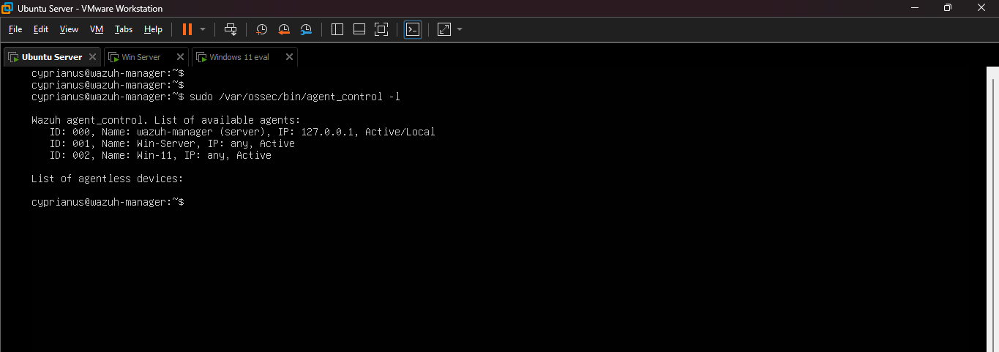
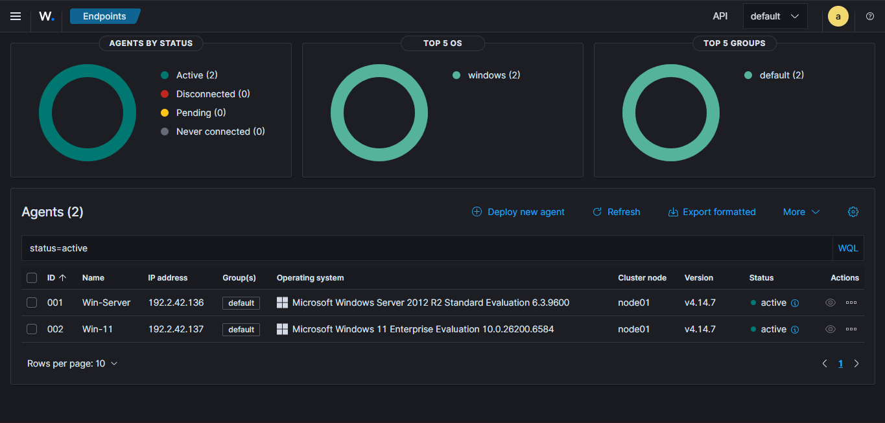
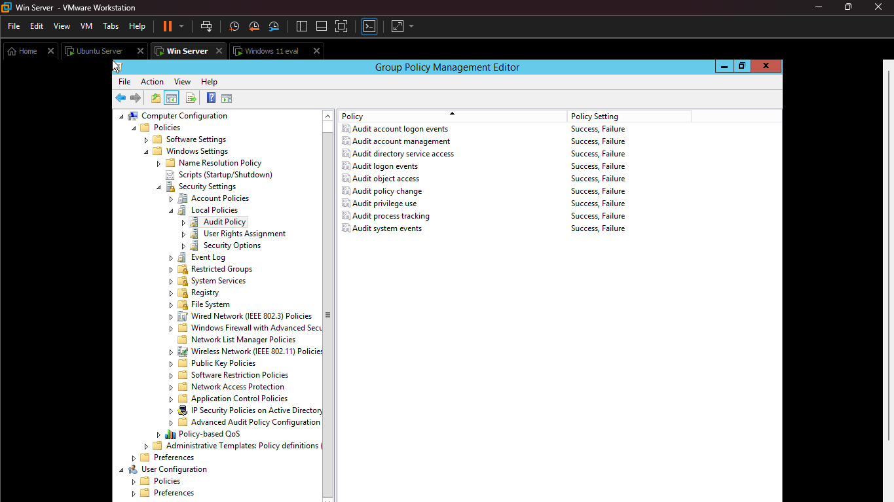
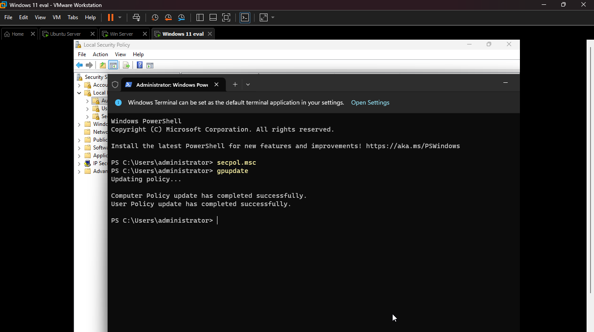
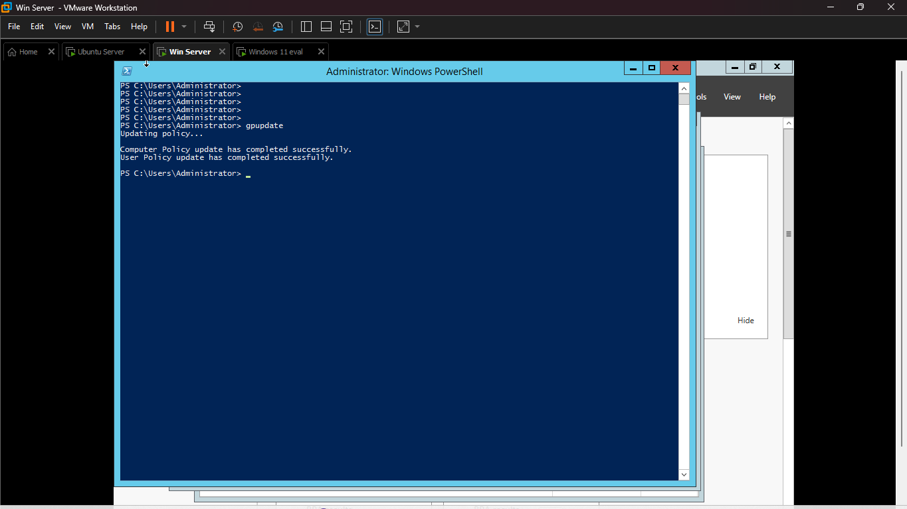
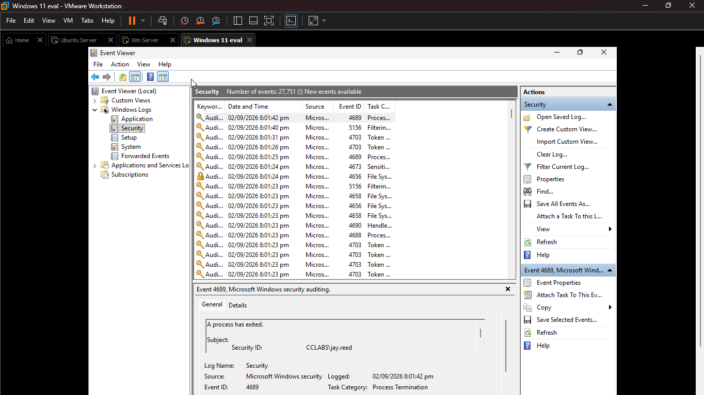
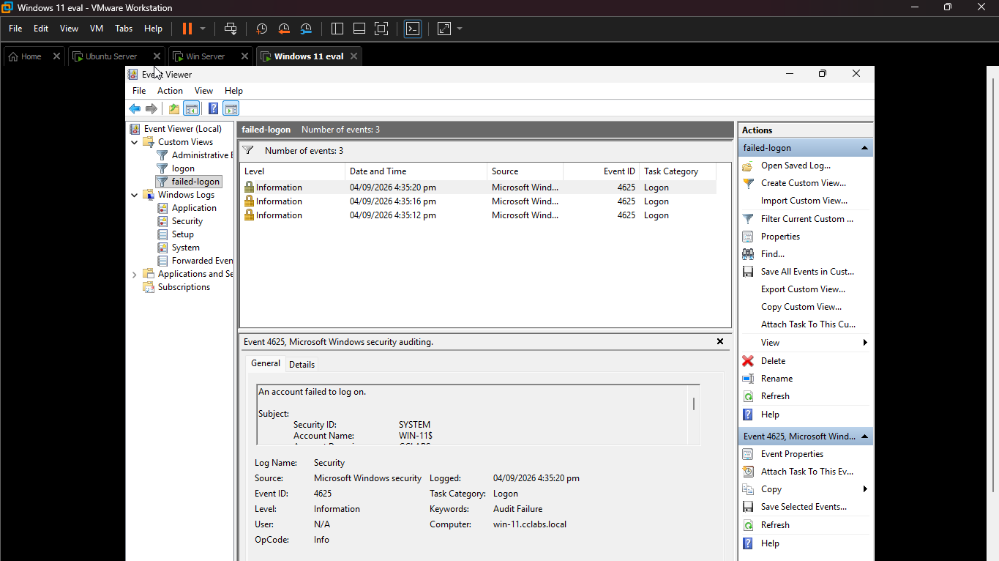

# Project 1 — SIEM Setup \& Log Ingestion Verification

**SOC Home Lab | Portfolio Project 1 of 5**

|Field|Detail|
|-|-|
|**Author**|Mojaki Tjeeka|
|**Date**|03 September 2026|
|**Environment**|Wazuh v4.14.7 · Windows Server 2012 · Windows 11|
|**Objective**|Confirm end-to-end log ingestion from AD DC and Windows 11 endpoint into Wazuh SIEM|

\---

## Skills Demonstrated

* SIEM agent deployment and health verification
* Windows Security Event log pipeline validation
* Windows audit policy configuration via Group Policy and PowerShell
* Log field analysis and alert triage within Wazuh
* Independent troubleshooting and root cause analysis

\---

## Network Environment

|Component|Role|IP Address|Agent ID|
|-|-|-|-|
|Ubuntu Server|Wazuh Manager v4.14.7|192.2.42.141|N/A (Manager)|
|Win-Server|Windows Server 2012 AD/DC|192.2.42.136|Agent-001|
|Win-11-Agent|Windows 11 Domain Endpoint|192.2.42.137|Agent-002|

> \*\*Note:\*\* All machines are on a bridged VMware LAN (`192.2.42.0/24`). See \[`network-diagram.png`](./network-diagram.png) for full architecture.

\---

## Steps Taken

### Step 1 — Agent Status Verification

Opened the Wazuh dashboard via browser on the host machine and navigated to the Agents section. Confirmed both agents were reporting **Active** status with correct IP addresses and agent IDs as listed in the environment table above.





\---

### Step 2 — Windows Audit Policy Configuration

Navigated to the Windows audit policy on both machines to ensure all relevant security events would be captured and forwarded to Wazuh. The following audit categories were verified and enabled for both **Success** and **Failure**:

* Audit account logon events
* Audit logon events
* Audit account management
* Audit process tracking
* Audit policy change

> ⚠️ \*\*Note:\*\* On Windows 11, `secpol.msc` was not accessible directly as a domain user. Resolved by opening PowerShell as Administrator and executing `secpol.msc` from the elevated prompt. See \[Troubleshooting](#troubleshooting-log) section for full detail.




\---

### Step 3 — Group Policy Update

After modifying audit policies, ran the following command on both machines to apply changes immediately:

```cmd
gpupdate /force
```

Expected output: `Computer Policy update has completed successfully.` and `User Policy update has completed successfully.`





\---

### Step 4 — Windows Event Log Verification

> ⚠️ \*\*Note:\*\* After running `gpupdate`, events were initially not appearing in Event Viewer. Resolved using `wevtutil` to re-enable the Security log channel. See \[Troubleshooting](#troubleshooting-log) for full detail.

Once resolved, Event Viewer (`eventvwr.msc`) confirmed the following event IDs were being generated:

|Event ID|Description|
|-|-|
|4624|Successful logon|
|4634|Logoff|
|4625|Failed logon (generated deliberately in Step 5)|
|4688|New process created|



\---

### Step 5 — Test Event Generation \& Wazuh Confirmation

To validate the full end-to-end pipeline, deliberate test events were generated and traced through to the Wazuh dashboard.

#### Test A — Successful Logon (Event ID 4624)

Logged off and back on to the Windows 11 machine using the domain account. This generates a 4624 event with logon type, source IP, and account details.

#### Test B — Failed Logon (Event ID 4625)

Attempted to access a network share on the Windows Server using deliberately incorrect credentials three consecutive times. This generates Event ID 4625 (failed logon) on the Domain Controller, attributable to the Windows 11 source IP (`192.2.42.137`).



\---

### Step 6 — Wazuh Pre-Built Alert Confirmation

Navigated to the Wazuh Alerts section and confirmed that the repeated failed logon events triggered Wazuh's built-in detection rule. **Rule ID 60106** fired, generating an alert for multiple authentication failures — demonstrating that Wazuh's correlation engine is active and functioning.


\---

## Troubleshooting Log

Four issues were encountered and independently resolved during this project.

\---

### Issue 1 — Wazuh Installation Failed on Ubuntu (VM Disk Configuration)

|||
|-|-|
|**Root Cause**|During VMware VM creation, the virtual disk was configured as *Split into multiple files* (split VMDK). Wazuh's installer requires contiguous disk allocation and failed during setup due to this fragmentation.|
|**Resolution**|Recreated the Ubuntu Server VM selecting *Store virtual disk as a single file* (compact/single VMDK) during the VMware disk configuration step. Wazuh installation completed successfully on the second attempt.|
|**Learning**|VMware disk format affects application installer compatibility. For server workloads and security tools, a single-file VMDK provides better performance and avoids installation failures caused by fragmented virtual disk allocation.|

\---

### Issue 2 — `secpol.msc` Inaccessible on Windows 11 as Domain User

|||
|-|-|
|**Root Cause**|When logged into Windows 11 with a standard domain user account, running `secpol.msc` via the Run dialog was blocked. Domain user accounts do not have local administrative privileges required to open the Local Security Policy editor directly.|
|**Resolution**|Opened PowerShell using *Run as Administrator* (entering local admin credentials when prompted). Executed `secpol.msc` from the elevated PowerShell prompt, which launched the editor with the required privileges.|
|**Learning**|Domain user accounts and local administrator accounts are distinct privilege contexts on domain-joined machines. Local security policy changes require local admin rights, not just domain credentials. Using an elevated shell is the correct method when the Run dialog is blocked by insufficient privileges.|

\---

### Issue 3 — Security Events Not Appearing in Event Viewer After `gpupdate`

|||
|-|-|
|**Root Cause**|After enabling audit policies and running `gpupdate /force`, the Windows Security event log was not populating with new events. The log channel appeared active but no events were being written.|
|**Resolution**|Ran the following command to re-enable and reinitialise the Security log channel: `wevtutil sl Security /e:true`. New events began appearing immediately after.|
|**Learning**|Windows event log channels can enter a degraded state, particularly in VM environments that have been cloned, snapshotted, or had policy changes applied. The `wevtutil` utility provides direct control over log channel state and is an important diagnostic tool when Event Viewer shows no output despite policy being configured correctly.|

\---

### Issue 4 — ERROR 3099: Wazuh Daemons Not Ready

|||
|-|-|
|**Root Cause**|After starting the Ubuntu VM, the Wazuh manager service failed to start with error code 3099. Multiple core daemons (`wazuh-modulesd`, `wazuh-analysisd`, `wazuh-execd`, `wazuh-db`, `wazuh-remoted`) all reported failed status. Root cause identified as insufficient system resources — the Ubuntu VM did not have enough allocated RAM/CPU for all Wazuh processes to start simultaneously.|
|**Resolution**|Stopped unnecessary services on the Ubuntu VM to free memory, then restarted the Wazuh manager: `sudo systemctl restart wazuh-manager`. All daemons started successfully after the resource contention was resolved.|
|**Learning**|Wazuh manager runs multiple concurrent daemons and requires adequate RAM allocation (minimum 4GB recommended). In a shared VMware environment with multiple VMs running simultaneously, resource contention is a common cause of service startup failures. Monitoring system resources with `htop` or `free -h` before starting Wazuh is good operational practice.|

\---

## Findings \& Results

### ✅ All Objectives Met

* Both Wazuh agents (Win-Server (Agent-001) and Win-11-Agent (Agent-002) confirmed Active with correct IP and agent ID
* Windows audit policies verified enabled for Success + Failure across all required categories on both machines
* Event ID 4625 test events confirmed visible in Wazuh within seconds of generation on both agents
* Full event field parsing confirmed — `targetUserName`, `ipAddress`, `eventID`, `systemTime` all correctly extracted
* Wazuh pre-built detection rule 60106 triggered successfully on repeated authentication failures
* Four real-world issues encountered, diagnosed, and resolved independently

### Key Observations

* Log ingestion confirmed working on both agents with no dropped events observed during testing
* Wazuh's built-in Windows ruleset correctly parsed Windows Security Event log fields without custom configuration
* The Domain Controller (Win-Server) generates significantly higher event volume than the endpoint, including Kerberos ticket events (4768, 4769) not present on the workstation
* Resource allocation in VMware directly impacts Wazuh daemon stability — a critical operational consideration in production SOC environments running virtualised SIEM infrastructure
* The `wevtutil` tool is a valuable diagnostic utility for Windows event log channel issues not resolvable through the GUI

### Wazuh Alert Generated

|Rule ID|Rule Description|Severity|Triggered By|
|-|-|-|-|
|**60106**|Windows repeated authentication failures — possible brute force|**Medium**|3× Event ID 4625 from 192.2.42.137|

\---

## Skills Mapped to SOC Analyst Job Requirements

|Job Requirement|Evidence from This Project|
|-|-|
|24x7 monitoring of SIEM and security systems|Deployed and validated Wazuh SIEM agent connectivity and log ingestion from two Windows endpoints|
|Collecting and analysing event data from SIEM tools|Filtered, searched, and analysed Windows Security Event logs within Wazuh including field-level event parsing|
|Microsoft Active Directory knowledge|Configured audit policies on a Windows Server 2012 Domain Controller and validated AD-specific event types (4768, 4769, 4720)|
|Scripting — PowerShell|Used elevated PowerShell to access `secpol.msc` and execute `wevtutil` commands to resolve event log issues|
|Multiple server software — Linux/Windows|Operated Ubuntu Server (Wazuh manager) and Windows Server 2022 simultaneously within the same lab environment|
|Applying expertise and advanced technologies|Independently diagnosed and resolved four distinct technical issues without external assistance|

\---

## Evidence Index

|#|Filename|Description|
|-|-|-|
|1|`01--wazuh-agents.png`|Wazuh Agents page — both agents Active|
|2|`02--agent-status.png`|Active agent status detail — Win-11 and Win-Server|
|3|`03--win-11-audit policy.png`|Windows 11 audit policy configuration (`secpol.msc`)|
|4|`04--win-server-audit-policy.png`|Windows Server audit policy configuration (DC)|
|5|`05--Win11-gpupdate.png`|Win11 `gpupdate /force` successful output|
|6|`06--win-server-pgupdate.png`|Win-Server `gpupdate /force` successful output|
|7|`07--win-11-security-event-log.png`|Windows 11 Security Event Log populated|
|8|`08--event-4625.png`|Wazuh — Event ID 4625 events with parsed fields|
|9|`09--rule-60106-alert.png`|Wazuh Alert — Rule 60106 triggered|
|10|`10--winserver-event-stream.png`|Win-Server agent event stream showing AD events|

> All screenshots are in the [`/screenshots`](./screenshots/) folder of this repository.

\---

*Part of the* [*SOC Home Lab Portfolio*](../README.md) *by Mojaki Tjeeka*

