# Post-Incident Report: Active Directory Privilege Escalation and Log Tampering

> **Project 5 of 5**: capstone of the CCLabs security portfolio. Covers detection, containment, evidence collection, eradication and recovery verification for a rogue-account attack on a Windows domain controller, monitored with Wazuh.

| | |
|---|---|
| **Incident Reference** | INC-2026-1007-001 |
| **Environment** | Windows Server (`Win-Server`, 192.2.42.136), Wazuh (`wazuh-manager`, 192.2.42.142) |
| **Incident window** | 06 Oct – 07 Oct 2026 |
| **Response date** | 08 Oct 2026 |
| **Prepared by** | Mojaki Tjeeka, SOC Analyst L1 |
| **Severity** | P1 – Critical (Wazuh rule levels 12–15) |
| **IR Framework** | NIST SP 800-61 Rev. 2 |
| **Status** | CLOSED – ERADICATED |
| **Tools** | PowerShell (ActiveDirectory module), Wazuh Threat Hunting, custom Wazuh rules |

---

## Table of Contents

1. [Executive Summary](#1-executive-summary)
2. [Scope and Affected Assets](#2-scope-and-affected-assets)
3. [Attack Timeline](#3-attack-timeline-from-wazuh)
4. [MITRE ATT&CK Mapping](#4-mitre-attck-mapping)
5. [Detection Analysis](#5-detection-analysis)
6. [Response Actions](#6-response-actions)
7. [Indicators of Compromise](#7-indicators-of-compromise)
8. [Root Cause and Open Questions](#8-root-cause-and-open-questions)
9. [Lessons Learned](#9-lessons-learned)
10. [Recommendations](#10-recommendations)
11. [Evidence Index](#11-evidence-index)

---

## 1. Executive Summary

Between Oct 6 and Oct 7, 2026, rogue accounts were created in Active Directory using the built-in `Administrator` account. At least one of them (`svc_test3`) was added to the Domain Admins group, and the Windows Security event log was cleared three times in an attempt to destroy forensic evidence. Wazuh forwarded the events off-host before they were cleared, so the full timeline could be reconstructed.

The attack followed three escalating waves, each with the same pattern: create account → escalate privileges → clear logs. The threat actor's dwell time in the environment was approximately **27 hours** (first account created 13:50 Oct 6; containment completed ~15:15 Oct 8).

On Oct 8, the threat was contained by disabling four rogue accounts and removing `svc_test3` from Domain Admins. After auditing every privileged group and collecting evidence, the accounts were permanently deleted and the Administrator password was reset. Post-eradication queries over a 37-minute monitoring window show no new account creation, privileged-group changes, or log clearing events.

---

## 2. Scope and Affected Assets

| Item | Detail |
|---|---|
| Host | Win-Server (192.2.42.136) — Windows Server 2012 R2, Domain Controller |
| Domain | cclabs.local |
| Monitoring | Wazuh manager `wazuh-manager` (192.2.42.142), agent ID 001 |
| Rogue accounts | `svc_backup`, `administrator2`, `svc_test3`, `svc_monitor` |
| Account used to perform the actions | `Administrator` (SubjectUserName on all 4720 events) |
| Privileged groups reviewed | Domain Admins, Enterprise Admins, Schema Admins, Administrators |

---

## 3. Attack Timeline (from Wazuh)

All times are UTC+2 (Africa/Johannesburg), Oct 2026.

| Time | Event ID | Rule | Level | Description |
|---|---|---|---|---|
| Oct 6, 13:50:23 | 4720 | 60109 | 8 | `svc_backup` created |
| Oct 6, 13:50:54 | 4720 | 60109 | 8 | `administrator2` created |
| Oct 6, 14:35:15 | 4728 | 60159 | 12 | Domain Admins group changed |
| Oct 6, 14:42:19 | 1102 | 63103 | 5 | Audit log cleared — **Wave 1 ends** |
| Oct 6, 15:58:41 | 4720 | 60109 | 8 | `svc_test2` created |
| Oct 6, 15:58:51 | 4728 | 60159 | 12 | Domain Admins group changed |
| Oct 6, 15:59:10 | 1102 | 63103 | 5 | Audit log cleared — **Wave 2 ends** |
| Oct 6, 16:48:54 | 4720 | 100003 | 12 | `svc_test3` created — custom rule fires |
| Oct 6, 16:52:19 | 4728 | 100004 | 14 | `svc_test3` added to Domain Admins — **DA escalation confirmed** |
| Oct 6, 16:53:34 | 1102 | 100005 | 15 | Audit log cleared — **Wave 3 ends** |
| Oct 7, 12:16:05 | 4720 | 100003 | 12 | `svc_monitor` created — late-stage persistence |

**Pattern:** The activity followed three repeated waves on Oct 6, each using the same sequence: create account → escalate privileges → clear logs. A fourth account was created on Oct 7 at 12:16, suggesting the attacker maintained access overnight. No matching privilege escalation or log clear was observed after the final account creation.

**Key observation:** The first two waves triggered only generic Wazuh rules (levels 5–12). By Wave 3, custom rules 100003, 100004 and 100005 were active — the result of detection engineering carried out in Project 3 — raising the alert levels to 12, 14 and 15 respectively. This validates the value of environment-specific rule tuning.

---

## 4. MITRE ATT&CK Mapping

| Tactic | Technique | Sub-technique | Observed behaviour |
|---|---|---|---|
| Initial Access / Persistence | T1078 – Valid Accounts | T1078.002 – Domain Accounts | All actions performed as built-in `Administrator` |
| Persistence | T1136 – Create Account | T1136.002 – Domain Account | Event 4720 × 5 — four rogue accounts created over two days |
| Privilege Escalation | T1098 – Account Manipulation | T1098.007 – Additional Container Cluster Roles | Event 4728 — `svc_test3` added to Domain Admins |
| Defence Evasion | T1070 – Indicator Removal | T1070.001 – Clear Windows Event Logs | Event 1102 × 3 — Security log cleared after each wave |
| Defence Evasion | T1036 – Masquerading | — | `svc_*` service-style account names and look-alike `administrator2` used to blend in |

---

## 5. Detection Analysis

Detection improved as the incident progressed. Waves 1 and 2 triggered only generic Wazuh rules at levels 5–12 because the environment-specific custom rules (100003–100005) had not yet been deployed at the time of the initial attack. Wave 3 was the first to fire the custom rules, immediately raising severity to levels 12, 14 and 15.

**Critical detection gap — log clearing:** The first two log clearing events (14:42 and 15:59 on Oct 6) were only detected at Level 5 via the default rule 63103. In a production SOC, Level 5 events typically fall below paging thresholds. The attacker operated with reduced SIEM visibility for approximately 2 hours and 11 minutes (14:42–16:53) before custom rule 100005 raised the severity of log clearing to Level 15.

**The log clearing was ultimately ineffective as an evasion technique.** Wazuh had already shipped the events to the manager before the local Security log was wiped. The full timeline could be reconstructed entirely from SIEM data — demonstrating the core value of off-host log forwarding.

---

## 6. Response Actions

### Phase 1: Containment

All four rogue accounts were disabled before deletion to preserve them as evidence and allow for further investigation if needed.

```powershell
Disable-ADAccount -Identity "svc_backup"
Disable-ADAccount -Identity "administrator2"
Disable-ADAccount -Identity "svc_test3"
Disable-ADAccount -Identity "svc_monitor"

# Verify — all must return Enabled: False
Get-ADUser -Filter {
    SamAccountName -like "svc_backup" -or
    SamAccountName -like "administrator2" -or
    SamAccountName -like "svc_test3" -or
    SamAccountName -like "svc_monitor"
} | Select Name, SamAccountName, Enabled

Remove-ADGroupMember -Identity "Domain Admins" -Members "svc_test3" -Confirm:$false
Get-ADGroupMember -Identity "Domain Admins" | Select Name, SamAccountName
```

**Results:**

- All four accounts: `Enabled: False` ✅
- Domain Admins: `Administrator` only ✅

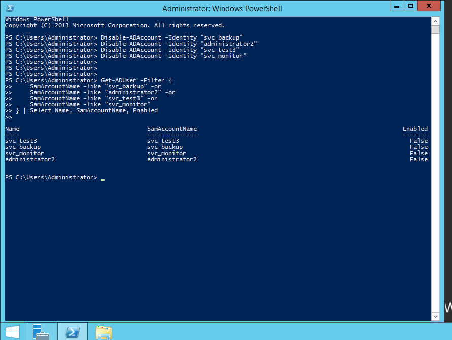
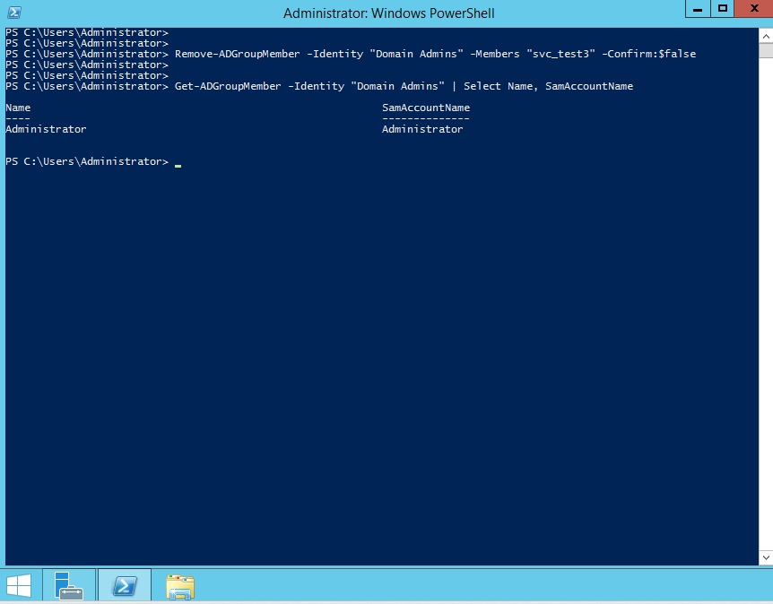

**Tier-0 group audit:**

```powershell
Get-ADGroupMember -Identity "Enterprise Admins" | Select Name, SamAccountName
Get-ADGroupMember -Identity "Schema Admins"     | Select Name, SamAccountName
Get-ADGroupMember -Identity "Administrators"    | Select Name, SamAccountName
```

- Enterprise Admins: `Administrator` only ✅
- Schema Admins: `Administrator` only ✅
- Administrators: `jay.reed`, Domain Admins, Enterprise Admins, Administrator — `jay.reed` confirmed as a legitimate domain account ✅

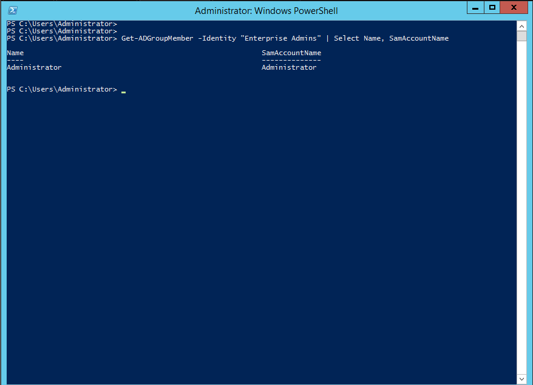
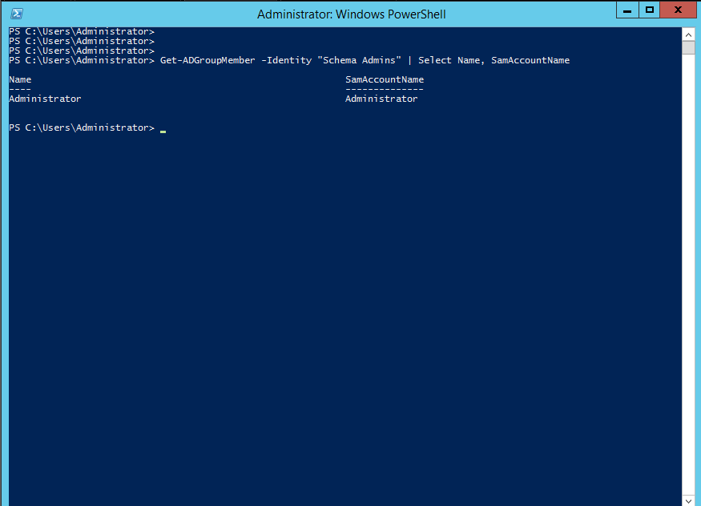
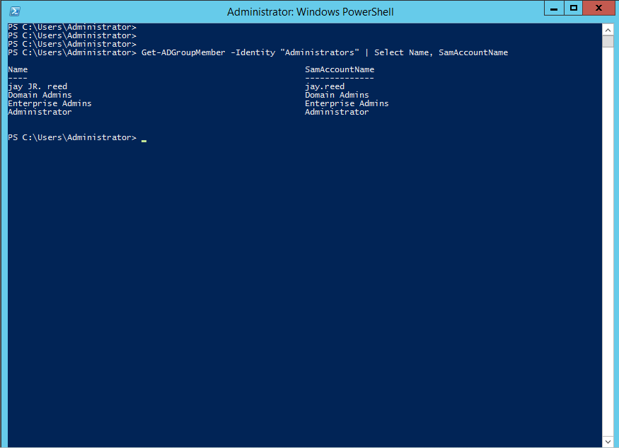

### Phase 2: Evidence Collection

Evidence was gathered from Wazuh Threat Hunting before accounts were deleted, ensuring the investigation was not compromised by eradication.

- **4720 (account creation)** filtered on `subjectUserName: Administrator` → 5 hits across Oct 6–7
- **4728 / 4729 (group membership changes)** for `svc_test3` → 4 hits including 1× rule 100004 (Level 14) and 3× containment-generated 4729 events on Oct 8 at 14:31, 14:32 and 14:34
- **1102 (audit log cleared)** → 3 hits including 1× rule 100005 (Level 15)

> **Note on the Oct 8 4729 events:** These were generated by the analyst's own `Remove-ADGroupMember` containment command. Their presence in Wazuh confirms that the SIEM was correctly monitoring and logging the IR actions — expected and desirable.

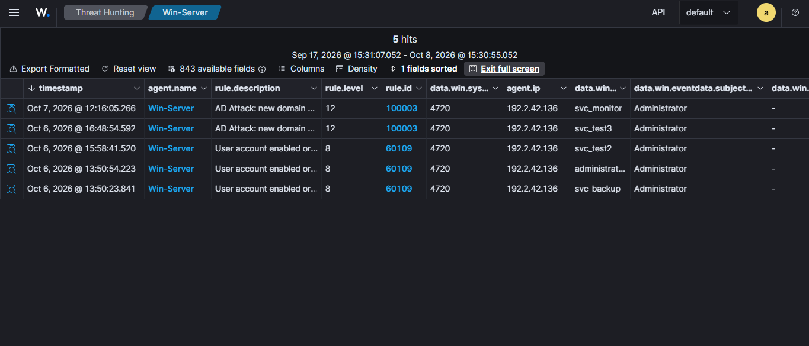
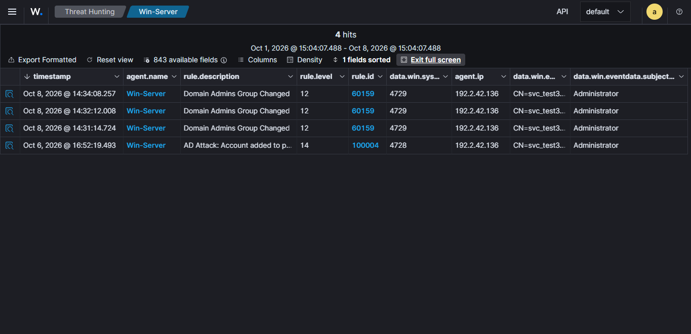
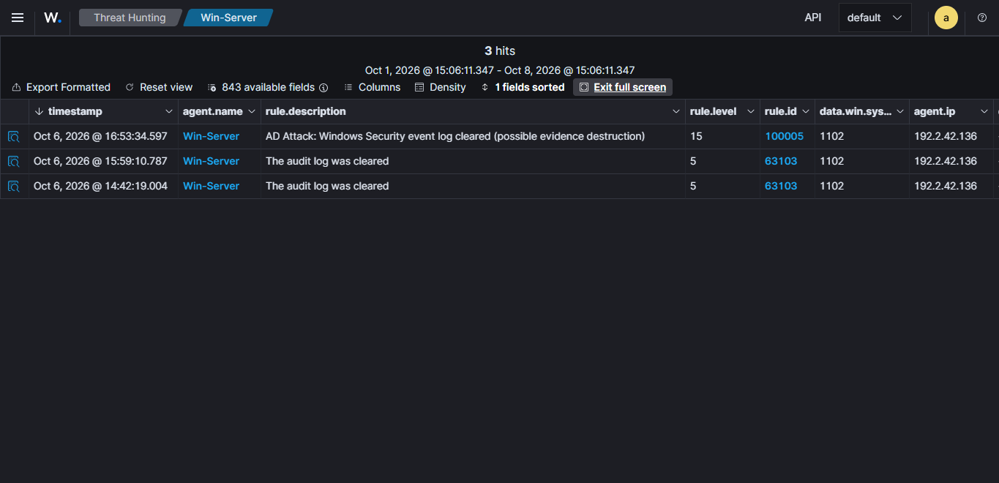

### Phase 3: Eradication

```powershell
Remove-ADUser -Identity "svc_backup"       -Confirm:$false
Remove-ADUser -Identity "administrator2"   -Confirm:$false
Remove-ADUser -Identity "svc_test3"        -Confirm:$false
Remove-ADUser -Identity "svc_monitor"      -Confirm:$false

# Verify — must return empty
Get-ADUser -Filter {
    SamAccountName -like "svc_backup" -or
    SamAccountName -like "administrator2" -or
    SamAccountName -like "svc_test3" -or
    SamAccountName -like "svc_monitor"
} | Select Name, SamAccountName

# Credential rotation
Set-ADAccountPassword -Identity "Administrator" -NewPassword (Read-Host -AsSecureString) -Reset
```

- Verification query returned **empty** — all accounts purged ✅
- Administrator password reset completed **08 Oct 2026, ~15:30** ✅

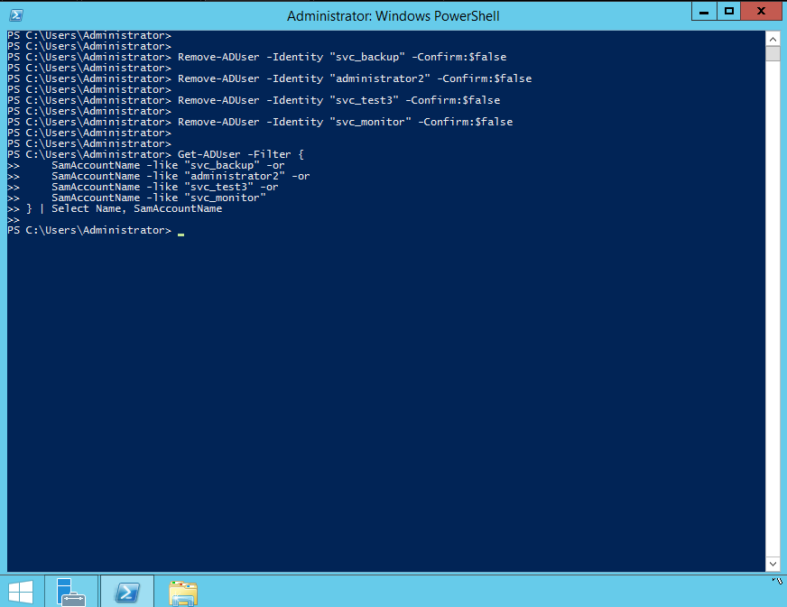

### Phase 4: Recovery Verification

Post-eradication monitoring window: **15:30–16:07, 08 Oct 2026 (37 minutes, 155 events)**

- No 4720 (account creation) events after Oct 7 12:16 ✅
- No 4728 (group membership addition) events after Oct 6 16:52 ✅
- No 1102 (log clearing) events in post-eradication window ✅
- Events observed were normal operational noise: 4957 (firewall audit failures), 4688 (process creation), 5140 (network share access), 4769 (Kerberos), 4624 (logon), 19009 (CIS compliance checks)

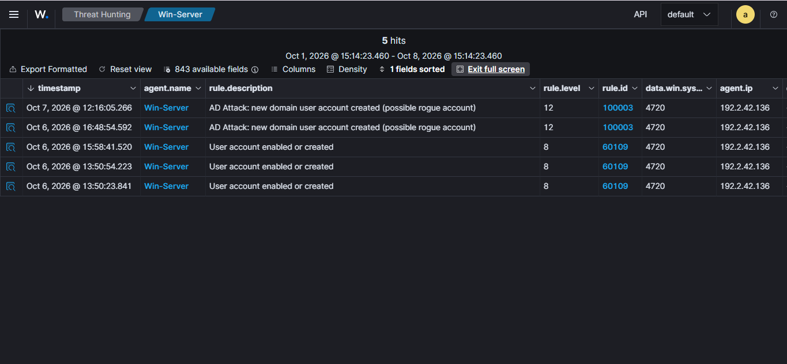
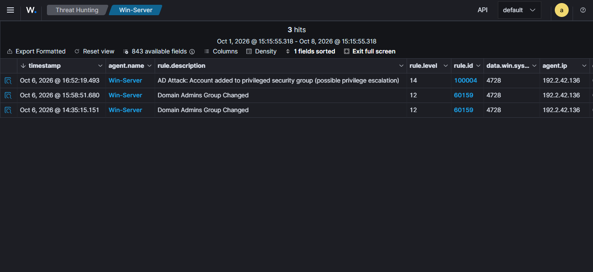
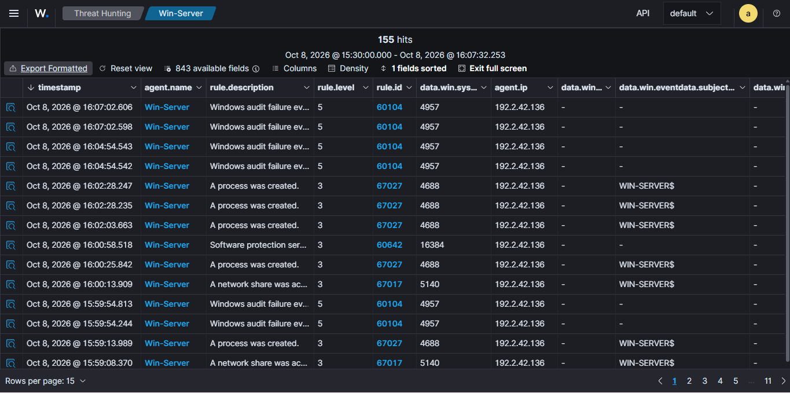
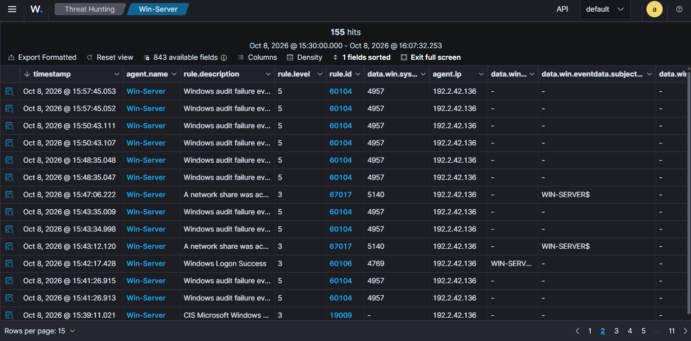
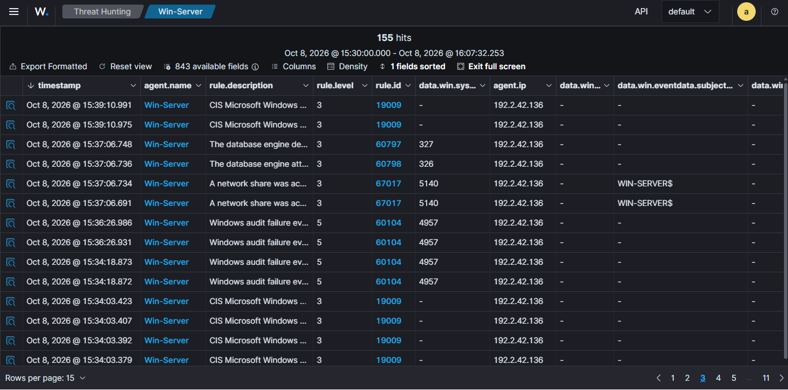

---

## 7. Indicators of Compromise

| Type | Value | Detail |
|---|---|---|
| Rogue accounts | `svc_backup`, `administrator2`, `svc_test3`, `svc_monitor` | Created Oct 6–7 by Administrator |
| AD object | `CN=svc_test3,CN=Users,DC=cclabs,DC=local` | Full DN — used as pivot IOC in threat hunt |
| Actor account | `Administrator` | SubjectUserName on all 4720 events |
| Event IDs | 4720, 4728, 4729, 1102 | Full attack chain |
| Custom Wazuh rules | 100003, 100004, 100005 | Levels 12, 14, 15 |
| Naming pattern | `svc_*` and `administrator2` | Service-style names designed to blend with legitimate accounts |
| Attack chain signature | 4720 → 4728 → 1102 within 60 min | Three-wave pattern, repeated |

---

## 8. Root Cause and Open Questions

Every account creation was performed by the built-in `Administrator` account (confirmed via `SubjectUserName` on all Event 4720 records). This raises the primary open question: **how was the Administrator account accessed?**

The incident window pre-dates structured brute-force detection in this environment (Projects 2–3 covered brute force against standard accounts). It is plausible that the Administrator account was accessed via an earlier brute-force attack not captured in the current log retention window, or via credential reuse.

**The initial access vector was not conclusively identified in the evidence reviewed.** The Administrator password has been reset, but a full investigation of authentication logs prior to Oct 6 13:50 would be required to close this gap.

---

## 9. Lessons Learned

### What worked

- **Off-host log forwarding preserved the evidence.** Despite three log clearing events, Wazuh had already indexed every Security event before the local log was wiped. The entire attack timeline was reconstructed from SIEM data alone.
- **Custom detection rules were decisive.** Rules 100003, 100004 and 100005 raised alert severity for AD abuse to levels 12–15. Without them, account creation would have fired only at Level 8 and log clearing only at Level 5 — below most SOC escalation thresholds.
- **Evidence was collected before eradication.** Accounts were disabled (not deleted) first; Wazuh screenshots were captured before `Remove-ADUser` was run. The investigation was not compromised by the cleanup.
- **Threat hunting connected the dots.** The individual alerts across two days did not individually justify a P1 response. Structured threat hunting (Project 4) reconstructed the unified timeline and produced the formal case note that triggered this IR.

### What to improve

- **Log clearing should always alert at the highest level.** Event 1102 has very few legitimate uses. Waves 1 and 2 fired only at Level 5, giving the attacker a 2+ hour window of reduced visibility.
- **Account creation needs a faster escalation path.** An alert on Event 4720 where `SubjectUserName` is `Administrator` should trigger an automated page or response, not just a log entry.
- **The built-in Administrator account should be restricted.** It should be used only for break-glass scenarios, with named admin accounts for routine administrative work and MFA enforced on all privileged access.
- **Privileged-group membership should be baselined and diffed.** Any change to Domain Admins, Enterprise Admins, Schema Admins or Administrators outside an approved change window should generate an immediate alert.

---

## 10. Recommendations

| # | Recommendation | Priority |
|---|---|---|
| 1 | Raise Event 1102 to Level 15 globally — no legitimate reason to clear the Security log in production | HIGH |
| 2 | Add a correlation rule: if 1102 fires within 60 min of 4720 or 4728, auto-escalate to P1 | HIGH |
| 3 | Alert and page on Event 4720 where SubjectUserName = Administrator — this should never happen in normal operations | HIGH |
| 4 | Baseline privileged-group membership; diff daily and alert on any change outside a change window | MEDIUM |
| 5 | Enforce MFA on all administrative accounts; disable or heavily monitor the built-in Administrator account | MEDIUM |
| 6 | Investigate the initial access path for the Administrator account — review authentication logs prior to Oct 6 13:50 | MEDIUM |
| 7 | Deploy Wazuh agent on Windows 11 endpoint to detect lateral movement from any future compromised DA account | MEDIUM |
| 8 | Document and test this response as a runbook — so future containment is faster and less reliant on ad-hoc PowerShell | LOW |

---

## 11. Evidence Index

| # | File | Shows |
|---|---|---|
| 1 | `screenshots/001-disable-accounts.png` | All four accounts `Enabled: False` |
| 2 | `screenshots/002-da-clean.png` | Domain Admins: only Administrator remains |
| 3 | `screenshots/003-enterprise-admins.png` | Enterprise Admins: Administrator only |
| 4 | `screenshots/004-schema-admins.png` | Schema Admins: Administrator only |
| 5 | `screenshots/005-administrators.png` | Administrators: `jay.reed` (confirmed legitimate), Domain Admins, Enterprise Admins, Administrator |
| 6 | `screenshots/006-wazuh-4720.png` | Wazuh — 5 account creation events (4720) by Administrator, Oct 6–7 |
| 7 | `screenshots/007-wazuh-4728.png` | Wazuh — DA escalation (4728, rule 100004) + 3× analyst containment events (4729) |
| 8 | `screenshots/008-wazuh-1102.png` | Wazuh — 3 log clearing events (1102), including rule 100005 at Level 15 |
| 9 | `screenshots/009-eradication.png` | `Get-ADUser` after `Remove-ADUser` — empty output confirms accounts purged |
| 10 | `screenshots/010-recovery-4720.png` | Post-eradication 4720 recheck — all events are historical; none new |
| 11 | `screenshots/011-recovery-4728.png` | Post-eradication 4728 recheck — all events are historical; none new |
| 12 | `screenshots/012-recovery-feed-p1.png` | Post-eradication general feed page 1 — normal activity only |
| 13 | `screenshots/013-recovery-feed-p2.png` | Post-eradication general feed page 2 — normal activity only |
| 14 | `screenshots/014-recovery-feed-p3.png` | Post-eradication general feed page 3 — normal activity only |

---

**Signed:** Mojaki Tjeeka, SOC Analyst L1 | **Date:** 2026-10-09 | **Status:** FINAL

---

*Part of the CCLabs five-project SOC portfolio. Screenshots are stored in [`/screenshots`](screenshots/).*
